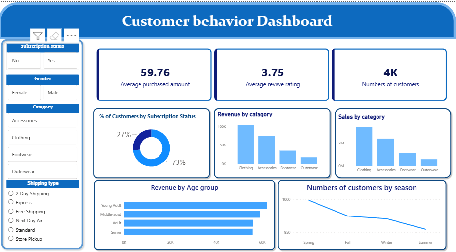

# Customer_behavior_project
Project: Customer behavior Data Analysis Dashboard using Python, MySQL & Power BI

# 📊 Customer Behavior Analysis Project

An end-to-end Data Analytics project that demonstrates the complete analytics workflow—from data cleaning and preprocessing to SQL analysis and interactive dashboard creation.

## 🚀 Project Overview

This project focuses on analyzing customer behavior data to uncover meaningful insights that help businesses understand purchasing patterns, customer preferences, and sales performance.

The workflow includes:

- Data Cleaning using Python
- Exploratory Data Analysis (EDA)
- Storing processed data in MySQL
- Writing SQL queries for business insights
- Building an interactive Power BI dashboard

---

## 🛠️ Tech Stack

- **Python**
  - Pandas
  - NumPy
  - Matplotlib
  - Seaborn
- **MySQL**
- **SQL**
- **Power BI**
- **Jupyter Notebook**

---

## 📂 Project Workflow

### 1. Data Cleaning
- Removed duplicate records
- Handled missing values
- Corrected inconsistent data
- Standardized data types
- Prepared data for analysis

### 2. Exploratory Data Analysis
- Customer demographics analysis
- Spending pattern analysis
- Product category analysis
- Sales trend analysis
- Customer segmentation

### 3. SQL Analysis
Performed SQL queries to answer business questions using:
- SELECT
- WHERE
- GROUP BY
- ORDER BY
- Aggregate Functions
- JOINS
- Subqueries

### 4. Dashboard Development
Created an interactive Power BI dashboard to visualize:

- 📈 Total Sales
- 👥 Total Customers
- 💰 Average Purchase Value
- 🛒 Product Performance
- 🌍 Regional Sales
- 📅 Monthly Sales Trends
- 📊 Customer Segmentation

---

## 📊 Key Insights

- Identified top-performing products.
- Analyzed customer purchasing behavior.
- Compared sales performance across different regions.
- Discovered monthly sales trends.
- Identified high-value customer segments.

---

## 📁 Project Structure

```
Customer_behavior_project/
│
├── Dataset/
├── Data Cleaning.ipynb
├── SQL Queries.sql
├── Power BI Dashboard.pbix
├── Images/
├── README.md
```

---

## 📸 Dashboard Preview

> Add screenshots of your Power BI dashboard here.

Example:

```
images/dashboard.png
```

---

## 🎯 Skills Demonstrated

- Data Cleaning
- Data Wrangling
- Exploratory Data Analysis
- SQL
- Database Management
- Business Intelligence
- Dashboard Design
- Data Visualization
- Analytical Thinking

---

## 📌 Business Questions Answered

- Which products generate the highest revenue?
- Which customer segment spends the most?
- Which regions contribute the highest sales?
- What are the monthly sales trends?
- Which customers are repeat buyers?

---

## 📈 Future Improvements

- Build predictive models for customer behavior.
- Add customer churn analysis.
- Automate ETL pipeline.
- Deploy an interactive dashboard online.

---

## 👨‍💻 Author

**Anish**

- GitHub: https://github.com/char-Anish
- LinkedIn: *(www.linkedin.com/in/anish-kumar-555-)*

---

## ⭐ If you found this project helpful, please consider giving it a Star!
